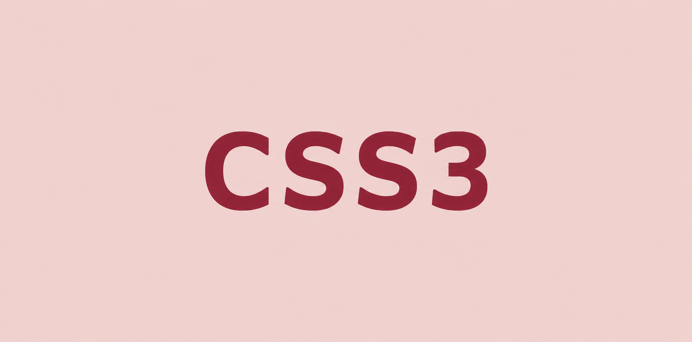
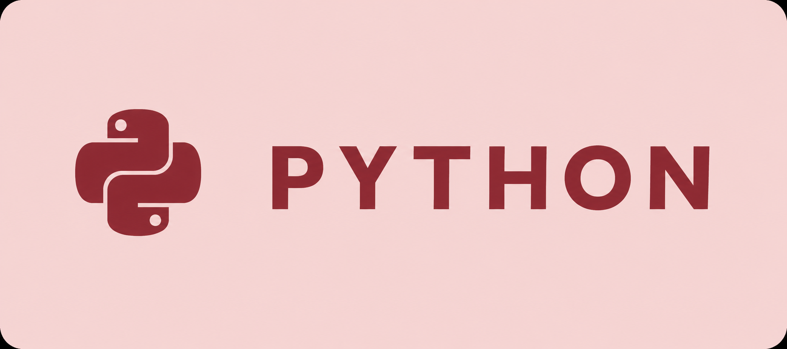
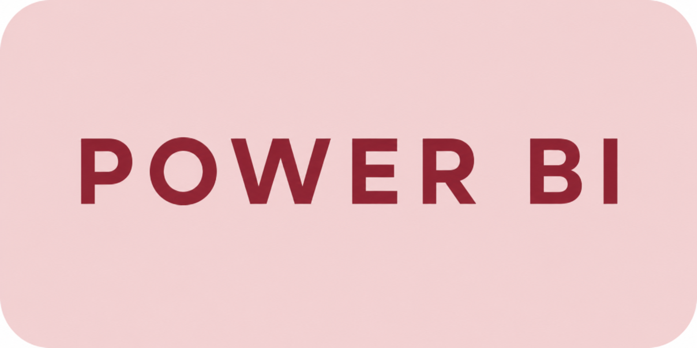

<h1 align="center">
  
</h1>

## About Me

Olá, Mundo! Atualmente sou estudante de <b>Sistemas de Informação</b> e Jovem Aprendiz na <b>IBM</b>, onde busco desenvolver minhas habilidades e ampliar meus conhecimentos em tecnologia.
Tenho grande interesse por <b>Python</b>, <b>IA</b> e Desenvolvimento <b>Full Stack</b>, com o objetivo de construir uma carreira voltada ao desenvolvimento de software e à criação de soluções que gerem impacto por meio da tecnologia.

## Tech Stack

  
  
  
  

## GitHub Stats

  
  

 

  

## Contribution

  

